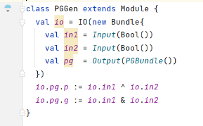
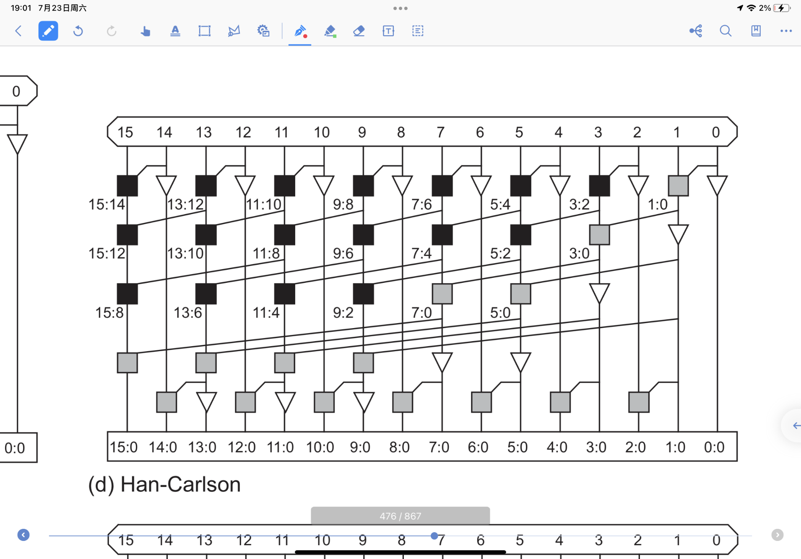
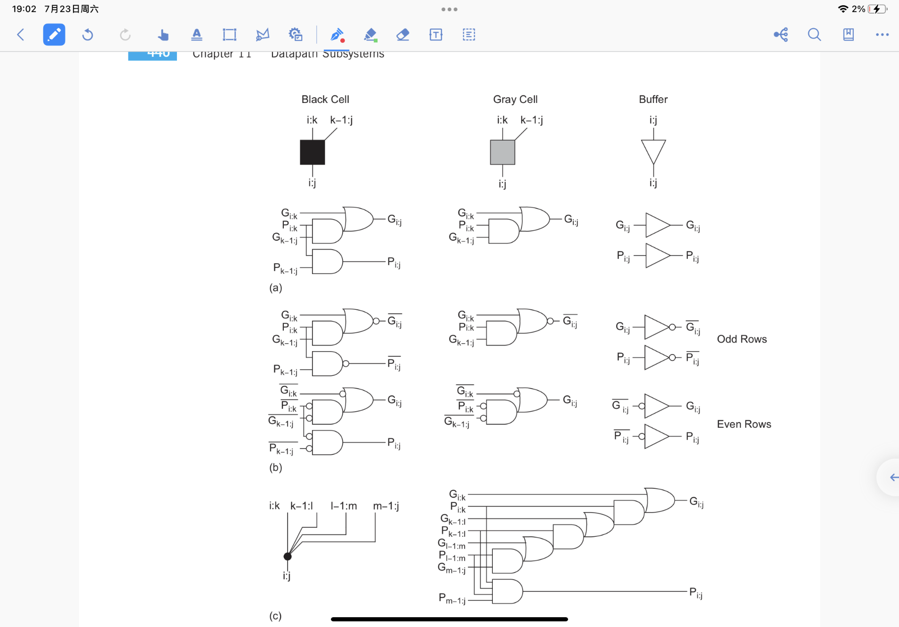

Full Adder
=======================

A project of `n` bits full adder

## PG Generator
````
P = in1 ^ in2
G = in1 & in2
````


Output is a bundle of `P` and `G`
## Carry Generator


## Sum

## Test